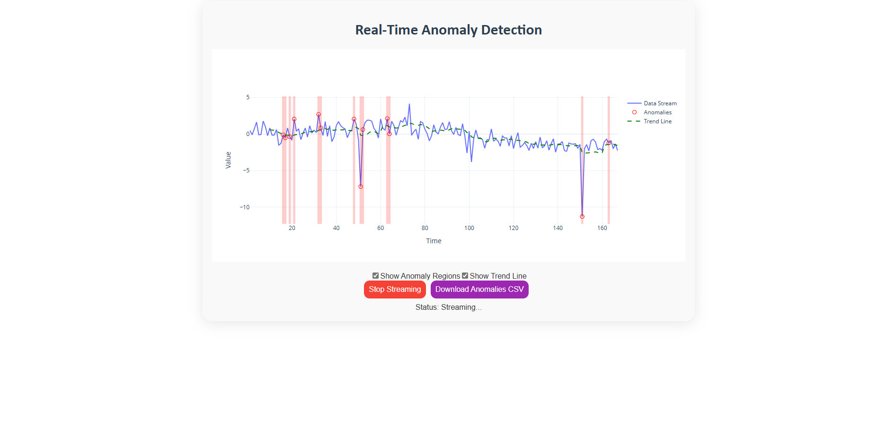

# Real-Time Anomaly Detection Dashboard


## Table of Contents

- [Real-Time Anomaly Detection Dashboard](#real-time-anomaly-detection-dashboard)
  - [Table of Contents](#table-of-contents)
  - [Overview](#overview)
  - [Features](#features)
  - [Demo](#demo)
  - [Installation](#installation)
    - [Prerequisites](#prerequisites)
    - [Steps](#steps)
  - [Usage](#usage)
  - [Project Structure](#project-structure)
    - [`app.py`](#apppy)
  - [Contributing](#contributing)
  - [License](#license)
  - [Acknowledgements](#acknowledgements)

## Overview

The **Real-Time Anomaly Detection Dashboard** is a Python-based application that simulates a real-time data stream, detects anomalies using River's Predictive Anomaly Detection algorithm, and visualizes the results through an interactive Dash web interface. This application is designed for monitoring and analyzing streaming data, providing users with the ability to start, stop, reset the data stream, and download detected anomalies for further analysis.

## Features

- **Real-Time Data Simulation**: Generates streaming data with dynamic concept drift and occasional anomalies.
- **Anomaly Detection**: Utilizes River's Predictive Anomaly Detection to identify anomalies in the data stream.
- **Interactive Dashboard**: Visualizes data and anomalies in real-time using Plotly and Dash.
- **Control Panel**: Start, stop, and reset the data stream with intuitive buttons.
- **Data Export**: Download detected anomalies as a CSV file for offline analysis.
- **Threading Support**: Ensures smooth and responsive performance during data streaming and processing.
- **Robust Error Handling**: Improved error handling and data validation to ensure application stability.

## Demo



*Figure: Real-Time Anomaly Detection Dashboard*

## Installation

### Prerequisites

- Python 3.8 or higher
- `pip` package manager

### Steps

1. **Clone the Repository**

    ```bash
    git clone https://github.com/HimanshuKumar17052001/real-time-anomaly-detection.git
    cd real-time-anomaly-detection
    ```

2. **Create a Virtual Environment**

    It's recommended to use a virtual environment to manage dependencies.

    ```bash
    python3 -m venv venv
    source venv/bin/activate  # On Windows: venv\Scripts\activate
    ```

3. **Install Dependencies**

    ```bash
    pip install -r requirements.txt
    ```

## Usage

1. **Run the Application**

    ```bash
    python app.py
    ```

2. **Access the Dashboard**

    Open your web browser and navigate to `http://127.0.0.1:8050/` to view the dashboard.

3. **Dashboard Controls**

    - **Start Streaming**: Begin the real-time data stream.
    - **Stop Streaming**: Halt the data stream.
    - **Reset**: Clear the current data and reset the simulation.
    - **Download Anomalies CSV**: Download a CSV file containing all detected anomalies.

## Project Structure
```plaintext
real-time-anomaly-detection/
│
├── app.py        # Main application script
├── requirements.txt       # Python dependencies
├── README.md              # Project documentation
├── screenshots/           # Directory for screenshots
│   └── dashboard.png
└── LICENSE                # License information
```

### `app.py`

Contains the core functionality, including data simulation, anomaly detection, and the Dash dashboard setup.

## Contributing

Contributions are welcome! Please follow these steps:

1. **Fork the Repository**

2. **Create a Feature Branch**

    ```bash
    git checkout -b feature/NewFeature
    ```

3. **Commit Your Changes**

    ```bash
    git commit -m "Add new feature"
    ```

4. **Push to the Branch**

    ```bash
    git push origin feature/NewFeature
    ```

5. **Open a Pull Request**

## License

This project is licensed under the [MIT License](LICENSE). You are free to use, modify, and distribute this software in any project.

## Acknowledgements

- [Dash by Plotly](https://dash.plotly.com/) for providing the framework for building interactive web applications.
- [River](https://riverml.xyz/) for the Predictive Anomaly Detection implementation.
- [NumPy](https://numpy.org/) and [Pandas](https://pandas.pydata.org/) for data manipulation and analysis.
